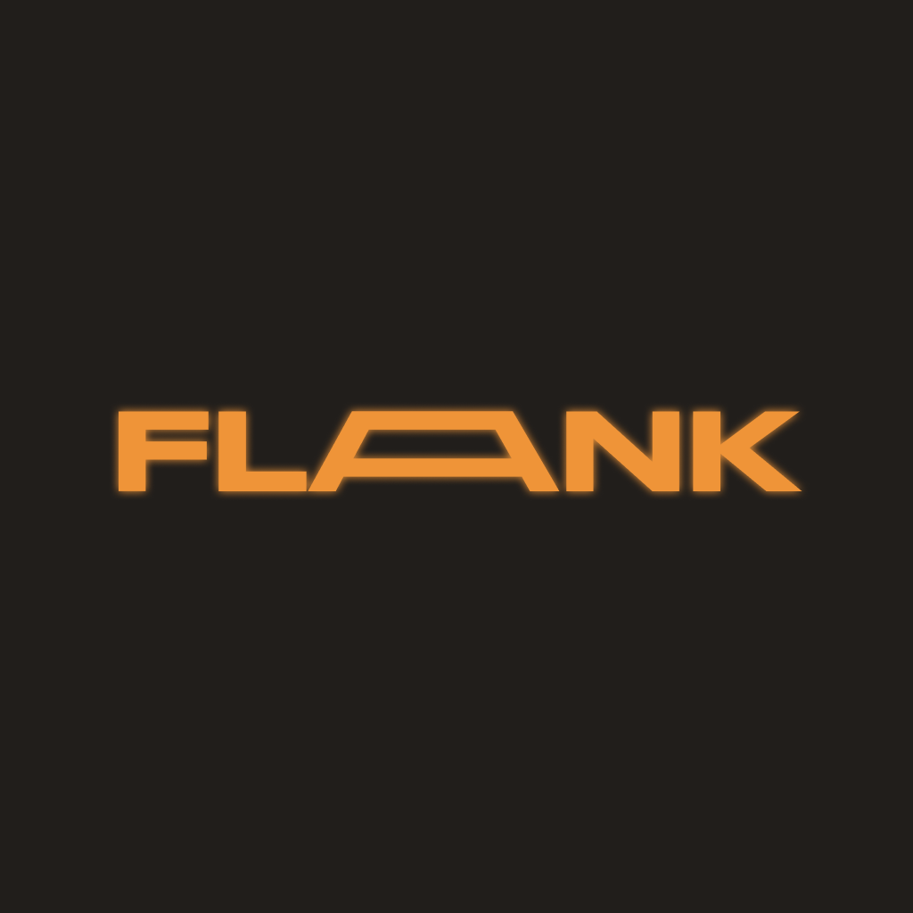

# Flank

  

  Your ultimate companion for Valorant esports coverage, delivering live matches, rankings, and news in a beautifully crafted SwiftUI experience.

  
  
  

## Features

- 🎮 **Live Matches**: Stay updated with ongoing professional Valorant matches
- 🏆 **Global Rankings**: Track your favorite teams' standings in real-time
- 📰 **Latest News**: Keep up with the latest developments in the Valorant esports scene
- 🌙 **Dark Mode Support**: Comfortable viewing experience day and night
- 📱 **Native iOS Experience**: Built with SwiftUI for smooth performance

## Screenshots

  
  
  
  
  

## Credits

Flank relies on the following amazing resources:

- [VLR.gg](https://vlr.gg) - The premier source for Valorant esports coverage, news, and match data
- [vlrggapi](https://github.com/axsddlr/vlrggapi) - An unofficial REST API for VLR.gg by Andre Saddler
